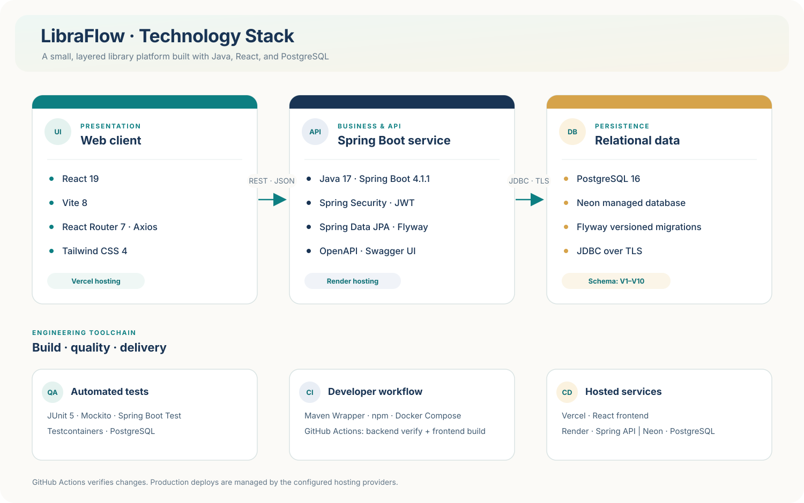
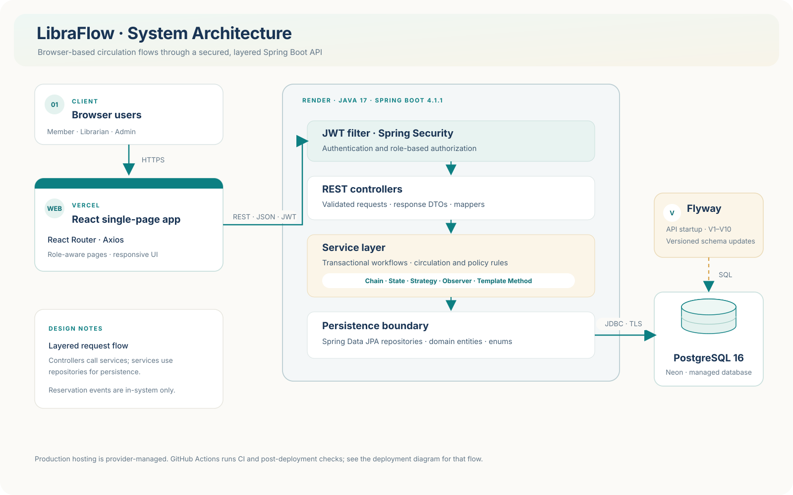

# LibraFlow

LibraFlow is a library management web application built for the CP353002 software design project. It supports a public book catalog and staff workflows for circulation, reservations, fines, and reports.

## Features

- Search the catalog by title, author, category, and availability.
- Let members borrow available titles or join a reservation queue.
- Manage books and physical copies, record loans and returns, and renew loans.
- Review member loan and fine history; record fine payments.
- Manage user roles and account status, and export loan and overdue reports.

## Team and responsibilities

The table describes each member's primary area of ownership. Features are integrated and reviewed across the team.

| # | Member | Student ID | Team role | Main responsibilities | Branch |
|---:|---|---|---|---|---|
| 1 | นายอชิรวัช บึงไสย์ | `673380298-3` | Backend Engineer · Catalog and Data | Book, copy, category, publisher, and author APIs; repository layer; OpenAPI/Swagger configuration | [`achirawat_673380298-3_01`](https://github.com/boatrocl/library_book_management/tree/achirawat_673380298-3_01) |
| 2 | นายวัชรวิศว์ น้อยเมล์ | `673380059-1` | Backend Engineer · Circulation | Loan, return, and renewal flows; State pattern and Chain of Responsibility rules | [`watcharawit_673380059-1_01`](https://github.com/boatrocl/library_book_management/tree/watcharawit_673380059-1_01) |
| 3 | นายกรกฏ พรมทอง | `673380025-8` | Backend Engineer · Fines, Reservations, and Reports | Fine Strategy, reservation events (Observer), and report formats (Template Method) | [`korakot_673380025-8_01`](https://github.com/boatrocl/library_book_management/tree/korakot_673380025-8_01) |
| 4 | นายปกรณ์เกียรติ ศรีจันทร์ | `673380045-2` | Frontend Engineer · UX/UI and API Integration | React pages and shared interface; Thai/English UI; integration with the REST API | [`pakornkiat_673380045-2_01`](https://github.com/boatrocl/library_book_management/tree/pakornkiat_673380045-2_01) |
| 5 | นายสรวิชญ์ ทะมานันท์ | `673380295-9` | Platform Engineer · Security, DevOps, and QA | JWT/security configuration; Docker; CI and deployment verification; unit and integration test infrastructure | [`sorawit_673380295-9_01`](https://github.com/boatrocl/library_book_management/tree/sorawit_673380295-9_01) |

## Technology stack



| Area | Technologies |
|---|---|
| Frontend | React 19, Vite 8, React Router 7, Axios, Tailwind CSS 4 |
| Backend | Java 17, Spring Boot 4.1.1, Spring Security, JWT, Spring Data JPA |
| Database and migrations | PostgreSQL 16, Neon, Flyway |
| API documentation | OpenAPI 3, springdoc, Swagger UI |
| Build and tests | Maven Wrapper, npm, JUnit 5, Mockito, Spring Boot Test, Testcontainers |
| Containers and delivery | Docker Compose, GitHub Actions CI, Vercel (frontend), Render (backend) |

Vercel and Render perform the application deployments through their provider integrations. GitHub Actions runs CI and a read-only smoke check after a successful production deployment; it does not deploy the application.

## System architecture



The React single-page application calls the Spring Boot REST API over HTTPS. Requests pass through JWT authentication and role authorization, then controllers delegate validated DTOs to services. Services apply circulation rules and patterns, repositories persist domain data through Spring Data JPA, and Flyway applies versioned database migrations at application startup.

The backend uses Chain of Responsibility for copy availability checks, State for loan transitions, Strategy for tier-based fine calculation, Spring application events for reservation hand-off, and Template Method for CSV/PDF reports. See [design patterns and code locations](doc/design-patterns.md) for implementation references.

- [Component diagram](doc/diagrams/12-component-diagram.puml)
- [Deployment and CI/CD diagram](doc/diagrams/13-deployment-diagram.puml)
- [Design patterns and code locations](doc/design-patterns.md)
- [Project scope and business rules](doc/project-overview.md)

## Database design and Flyway migrations

The ER diagram and data dictionary describe the catalog, accounts, circulation, reservations, and fines schema.

- [ER diagram (SVG)](doc/diagrams/images/11-er-diagram.svg)
- [ER diagram source](doc/diagrams/11-er-diagram.puml)
- [Data dictionary](doc/data-dictionary.md)

| Migration | Purpose | Primary owner |
|---|---|---|
| `V1__init_catalog.sql` | Create categories, publishers, authors, books, book-author links, and physical copies | Member 1 |
| `V2__seed_catalog.sql` | Seed catalog data for local use and demonstrations | Member 1 |
| `V3__init_users.sql` | Create users and one-to-one user profiles | Member 5 |
| `V3_1__add_role_and_auth_seed.sql` | Add account roles and seed authentication accounts | Member 5 |
| `V4__init_loan.sql` | Create loans and loan items with status and renewal constraints | Member 2 |
| `V5__init_fine_reservation.sql` | Create fines and reservation tables and indexes | Member 3 |
| `V7__add_tier_to_users.sql` | Add the member tier used by borrowing and fine policies | Team |
| `V8__add_fine_reservation_foreign_keys.sql` | Add and validate foreign keys for fines and reservations | Team |
| `V9__reserve_book_copy_for_ready_reservations.sql` | Associate READY reservations with held copies and enforce expiry data | Team |
| `V10__tighten_user_indexes_and_fine_status.sql` | Remove redundant user indexes and constrain fine status values | Team |

There is no `V6` migration in the repository. Do not backfill an older version number or edit a migration that has already been applied; add the next unused version instead.

## Run locally

Requirements: Docker with Compose, Java 17, and Node.js 20.19+ or 22.12+.

1. Create a local environment file and set a development JWT secret:

   ```bash
   cp .env.example .env
   openssl rand -base64 32
   ```

   Put the generated value in `JWT_SECRET` in `.env`. Do not commit `.env` or real credentials.

2. Start PostgreSQL and the backend:

   ```bash
   docker compose up -d --build db backend
   ```

   Compose starts the database and backend only. The frontend is run separately.

3. In another terminal, start the frontend:

   ```bash
   cd code/frontend
   npm ci
   npm run dev
   ```

Local URLs:

| Service | URL |
|---|---|
| Frontend | http://localhost:5173 |
| Backend API | http://localhost:8080 |
| Swagger UI | http://localhost:8080/swagger-ui.html |

## Verify changes

Run the same checks used by the repository's CI workflows:

```bash
cd code/backend
./mvnw --batch-mode --no-transfer-progress clean verify
```

```bash
cd code/frontend
npm ci
npm run lint
npm run build
```

Backend integration tests use PostgreSQL through Testcontainers and require Docker. GitHub Actions runs backend verification and frontend lint/build on pushes to all branches and on pull requests into `develop` or `main`:

- `.github/workflows/backend-ci.yml`
- `.github/workflows/frontend-ci.yml`

The CI workflows do not deploy the LibraFlow application. After Vercel reports a successful Production deployment, `production-deployment-smoke.yml` checks the deployed SPA routes, OpenAPI document, and public catalog. This is a post-deploy verification; Vercel's GitHub integration performs the frontend deployment.

## CD teaching demo

The separate [CD Demo](doc/cd-demo.md) builds and validates a small status page, then publishes that artifact to GitHub Pages. It does not deploy the LibraFlow app or change its Vercel, Render, or Neon services. The production smoke check observes the provider deployment after it completes; it does not deploy the app or replace provider configuration.

## API and deployment

- [REST API specification](doc/api-spec.md)
- [Swagger UI](https://library-book-management-ybt2.onrender.com/swagger-ui.html)
- Frontend: https://library-book-management-alpha.vercel.app/
- Backend: https://library-book-management-ybt2.onrender.com/

The deployment URLs do not by themselves prove which Git branch or database branch is configured. Verify those values in the provider dashboards before describing the production release path.

## Current scope limits

- Reservation notifications are written to application logs; no external email or SMS provider is connected.
- Fines are recorded when a late item is returned; the scheduler changes loan status but does not add a daily balance.
- The API currently has no return-condition workflow for marking a returned copy damaged or repairing/discarding it.
- Fine payment records an in-system payment; no online payment gateway is connected.

## Repository map

```text
.github/workflows/       Backend CI, frontend CI, isolated CD demo
code/backend/            Spring Boot API and tests
code/frontend/           React application
doc/                     Requirements, API, design analysis, diagrams
test/report/             Verification notes
docker-compose.yml        Local PostgreSQL and backend services
```

## Contribution flow

Use a task branch, open a pull request into `develop`, and request review. Merge `develop` into `main` for a release after CI and review are complete. Use descriptive commits such as `feat:`, `fix:`, `test:`, `refactor:`, and `docs:`.
