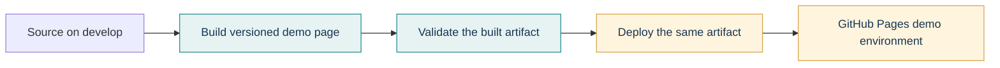

# CD Demo: Build → Validate → Deploy

This demo makes the difference between continuous integration (CI) and continuous delivery/deployment (CD) visible without changing the production LibraFlow deployment.

## What happens



- **CI part:** build the demo page and validate that the generated HTML and deployment metadata are complete.
- **CD part:** take that validated artifact and publish it to the `github-pages` environment.
- The page shows the commit, workflow run, and build time so the deployed version can be identified.

The workflow runs on `workflow_dispatch` and when the demo files change on `develop`. The deployment job only runs for `develop`. It does not deploy the React application, change Vercel or Render, or connect to the production database. The validation job checks this small demo artifact; it does not replace the project's backend or frontend CI.

## One-time GitHub Pages setup

After the workflow is merged into the repository's default branch (`develop`), open:

**Repository Settings → Pages → Build and deployment → Source → GitHub Actions**

Then run **Actions → CD Demo → Run workflow** on `develop`, or push a change to `doc/cd-demo/` or `scripts/cd-demo/`. The successful deploy job shows the Pages URL. The repository did not have a Pages site configured when this demo was prepared, so the first deployment needs that one-time setting.

## How this relates to the course CD bonus

This is a teaching/demo deployment only. The course rubric's CI/CD bonus describes an automatic GitHub Actions **Build → Test → Deploy** workflow for the submitted application. This demo does not make the production LibraFlow app meet that criterion. Vercel/Render may separately auto-deploy from a provider integration, but that must be verified in those dashboards and is not the same as a GitHub Actions deploy job.

## Run the demo build and validation locally

From the repository root:

```bash
node scripts/cd-demo/build.mjs
node scripts/cd-demo/verify.mjs build/cd-demo/site
```

The generated page is `build/cd-demo/site/index.html`. It records the local Git commit and build time. These commands demonstrate the build and validation stages; the deploy stage runs in GitHub Actions after Pages is configured.
